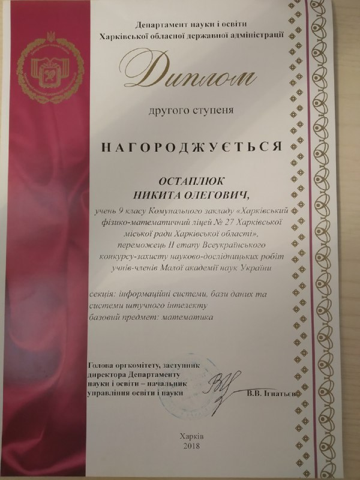
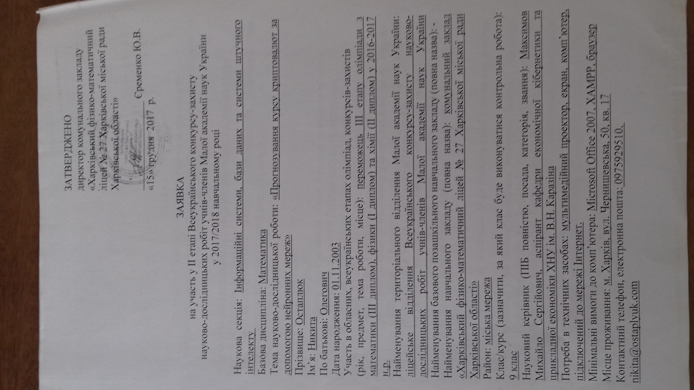

# Документи
## Пункти акредитації:
**1) наявність не менше п’яти публікацій у періодичних наукових виданнях, що включені до переліку фахових видань України, до наукометричних баз, зокрема Scopus, Web of Science Core Collection;**  
1. Максимов М.С. Інформаційний профіль малого та середнього бізнесу в України та ЄС: аналіз методик та показників //Вісник Харківського національного університету імені В.Н. Каразіна, серія «Економічна». -  2016. - №90. – С. 116 – 130.
2. Максимов М. С. Снижение когнитивной нагрузки при разработке бизнес-плана в малом бизнесе // Бизнес Информ. – 2017. – №1. – C. 161–166.
3. Максимов М. С. Розвиток та підтримка малого та середнього підприємництва в Україні в державних і регіональних стратегічних документах // Бізнес Інформ. – 2016. – №11. – C. 196–203.
4. Максимов М. С. Алгоритм розробки програми підтримки підприємництва. // Бізнес Інформ. – 2017. – №10.
5. Моделі державної політики в сфері підтримки малого та середнього підприємництва // Вісник Харківського національного університету імені ВН Каразіна серія «Економічна»  -  2018. - №94. – С. 70 – 81.
6. Грецька-Миргородська В. В., Максимов М. С. Концепції соціально орієнтованої економіки та поведінковий підхід як змістовний базис для державної політики у сфері місцевого соціально-економічного розвитку. Бізнес Інформ. 2019. №8. C. 59–71.обращения

**14) керівництво постійно діючим студентським науковим гуртком**  
Студентський науковий гурток "Розробка програмних продуктів"

**15) керівництво школярем, який зайняв призове місце II—III етапу Всеукраїнських конкурсів-захистів науково-дослідницьких робіт учнів — членів Національного центру “Мала академія наук України”;**

  
  

**19) діяльність за спеціальністю у формі участі у професійних та/або громадських об’єднаннях;**
Запит зробив

**20) досвід практичної роботи за спеціальністю не менше п’яти років (крім педагогічної, науково-педагогічної, наукової діяльності).**
Свідостство фізичної особи-підприємця.